# nested_array

🎉 Мои поздравления! Вышла версия 3.0.

Гем `nested_array` позволяет преобразовать плоский массив данных древовидной
структуры во вложенный массив, а так же помогает отобразить деревья формируя
HTML вёрстку или псевдографику.

Древовидная структура должна быть описана по шаблону Списка смежности
(Adjacency List), то есть в каждом узле указан предок.

__Выбрать язык README.md__

-   en [English](README.md)
-   ru [Русский](README-ru.md)


## <a id="Оглавление"></a>Оглавление
-   [Установка](#1)
-   [Использование](#2)
    -   [Преобразование данных методом `.to_nested`](#2.1)
        -   [Исходные данные – массив хэш](#2.1.1)
        -   [Исходные данные – массив ActiveRecord](#2.1.2)
        -   [Опции метода `.to_nested`](#2.1.3)
            -   [`root_id: id`](#2.1.3.1)
            -   [`branch_id: id`](#2.1.3.2)
    -   [Отображение древовидных структур](#2.2)
        -   [В виде многоуровневых списков](#2.2.1)
            -   [Маркированный и нумерованный списки `<ul>`, `<ol>`](#2.2.1.1)
            -   [Использование собственных шаблонов для отображения списка](#2.2.1.2)
            -   [Изменение шаблона в зависимости от данных узла](#2.2.1.3)
            -   [Расскрывающийся список на основе тега `<details></details>`](#2.2.1.4)
            -   [Формирование и вывод собственных шаблонов опираясь на изменение уровня узла `node.level`](#2.2.1.5)
        -   [В виде псевдографики](#2.2.2)
            -   [Добавление псевдографики перед именем модели методом `nested_to_options`](#2.2.2.1)
            -   [Тонкая псевдографика](#2.2.2.2)
            -   [Собственная псевдографика](#2.2.2.3)
            -   [Увеличение отступа в собственной псевдографике](#2.2.2.4)
        -   [В формах](#2.2.3)
            -   [С хелпером `form.select`](#2.2.3.1)
            -   [С хелперами `form.select` и `options_for_select`](#2.2.3.2)
            -   [Раскрывающийся список с переключателями `form.radio_button`](#2.2.3.3)


## <a id="1"></a>Установка [↑](#Оглавление "К оглавлению")

1. Добавте строку в файл _Gemfile_ вашего приложения:

```ruby
# Работа с древовидными массивами
gem "nested_array", "~> 3.0"
```

И выполните `bundle install`.

2. Если вы планируете использовать скромные CSS стили гема, добавте в
файл _app/assets/stylesheets/application.scss_:

```css
/* Отображение древовидных массивов */
@import "nested_array";
```


## <a id="2"></a>Использование [↑](#Оглавление "К оглавлению")

### <a id="2.1"></a>Преобразование данных методом `.to_nested` [↑](#Оглавление "К оглавлению")

#### <a id="2.1.1"></a>Исходные данные – массив хэш [↑](#Оглавление "К оглавлению")

Допустим, есть массив хэш:

```rb
flat = [
  {'id' => 3, 'parent_id' => nil},
  {'id' => 2, 'parent_id' => 1},
  {'id' => 1, 'parent_id' => nil}
]
```

Где каждый хэш это узел дерева, `id` — идентификатор узла,
`parent_id` — указатель на родительский узел.

Необходимо преобразовать в массив в котором будут только корневые узлы
(`'parent_id' => nil`), а дочерние узлы помещены в поле
`children`.

```rb
nested = flat.to_nested
puts nested.pretty_inspect
```

Выведет:

```
[#<OpenStruct id=3, parent_id=nil, level=0, origin={"id"=>3, "parent_id"=>nil}>,
 #<OpenStruct id=1, parent_id=nil, level=0, children=[#<OpenStruct id=2, parent_id=1, level=1, origin={"id"=>2, "parent_id"=>1}>], origin={"id"=>1, "parent_id"=>nil}>]
```

В результате узлы представляют собой объекты `OpenStruct` у которых
исходные поля `id`, `parent_id` и дополнительные поля
`level`, `origin` и `children`.

В качестве исходных узлов могут быть и объекты ActiveRecord.


#### <a id="2.1.2"></a>Исходные данные – массив ActiveRecord [↑](#Оглавление "К оглавлению")

```rb
catalogs = Catalog.all.to_a
nested = catalogs.to_nested
puts nested.pretty_inspect
```

Выведет:

```
[
  #<OpenStruct id=1, parent_id=nil, level=0, origin=#<Catalog id: 1, name: "Computer Components", parent_id: nil>, children=[
    #<OpenStruct id=11, parent_id=1, level=1, origin=#<Catalog id: 11, name: "External Components", parent_id: 1>, children=[
      #<OpenStruct id=111, parent_id=11, level=2, origin=#<Catalog id: 111, name: "Hard Drives", parent_id: 11>>,
      #<OpenStruct id=112, parent_id=11, level=2, origin=#<Catalog id: 112, name: "Sound Cards", parent_id: 11>>,
      #<OpenStruct id=113, parent_id=11, level=2, origin=#<Catalog id: 113, name: "KVM Switches", parent_id: 11>>,
      #<OpenStruct id=114, parent_id=11, level=2, origin=#<Catalog id: 114, name: "Optical Drives", parent_id: 11>>
    ]>,
    #<OpenStruct id=12, parent_id=1, level=1, origin=#<Catalog id: 12, name: "Internal Components", parent_id: 1>>
  ]>,
  #<OpenStruct id=2, parent_id=nil, level=0, origin=#<Catalog id: 2, name: "Monitors", parent_id: nil>>,
  #<OpenStruct id=3, parent_id=nil, level=0, origin=#<Catalog id: 3, name: "Servers", parent_id: nil>>,
  #<OpenStruct id=4, parent_id=nil, level=0, origin=#<Catalog id: 4, name: "Networking Products", parent_id: nil>>
]
```

<sub>Метод `.to_nested` использует метод `object.serializable_hash`, чтобы получить список полей объекта.</sub>


#### <a id="2.1.3"></a>Опции метода `.to_nested` [↑](#Оглавление "К оглавлению")

##### <a id="2.1.3.1"></a>`root_id: id` [↑](#Оглавление "К оглавлению")

`root_id: 1` — взять потомков узла с `id` равным `1`.

```erb
<% catalogs_of_1 = Catalog.all.to_a.to_nested(root_id: 1) %>
<ul>
  <% catalogs_of_1.each_nested do |node, origin| %>
    <%= node.before -%>
    <%= origin.name -%> <small>[<%= origin.id %>, <%= origin.parent_id || :nil %>, <%= node.level %>]</small>
    <%= node.after -%>
  <% end %>
</ul>
```

Выведет многоуровневый маркированный список потомков узла №1:

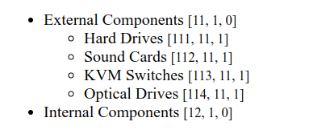


##### <a id="2.1.3.2"></a>`branch_id: id` [↑](#Оглавление "К оглавлению")

`branch_id: 1` — взять узел с `id` равным `1` и всех его потомков.

```erb
<% catalogs_from_1 = Catalog.all.to_a.to_nested(branch_id: 1) %>
<ul>
  <% catalogs_from_1.each_nested do |node, origin| %>
    <%= node.before -%>
    <%= origin.name -%> <small>[<%= origin.id %>, <%= origin.parent_id || :nil %>, <%= node.level %>]</small>
    <%= node.after -%>
  <% end %>
</ul>
```

Выведет узел №1 и его потомков:

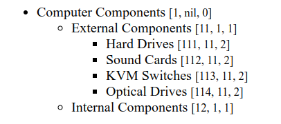


### <a id="2.2"></a>Отображение древовидных структур [↑](#Оглавление "К оглавлению")

#### <a id="2.2.1"></a>В виде многоуровневых списков [↑](#Оглавление "К оглавлению")

##### <a id="2.2.1.1"></a>Маркированный и нумерованный списки `<ul>`, `<ol>` [↑](#Оглавление "К оглавлению")

```erb
<ul>
  <% @catalogs.to_a.to_nested.each_nested do |node, origin| %>
    <%= node.before %>
    <%= link_to origin.name, origin %> <small>[<%= origin.id %>, <%= origin.parent_id || :nil %>, <%= node.level %>]</small>
    <%= node.after %>
  <% end %>
</ul>

<ol>
  <% @catalogs.to_a.to_nested.each_nested ul: '<ol>', _ul: '</ol>' do |node, origin| %>
    <%= node.before %>
    <%= link_to origin.name, origin %> <small>[<%= origin.id %>, <%= origin.parent_id || :nil %>, <%= node.level %>]</small>
    <%= node.after %>
  <% end %>
</ol>
```

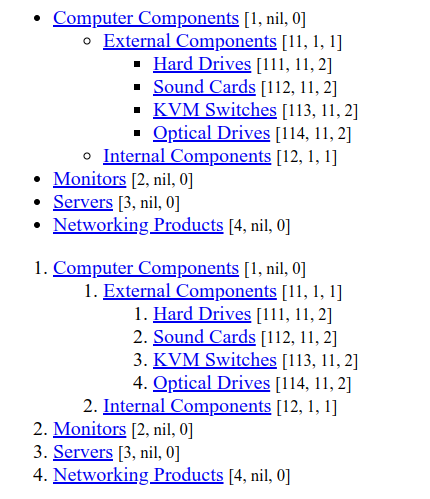


##### <a id="2.2.1.2"></a>Использование собственных шаблонов для отображения списка [↑](#Оглавление "К оглавлению")

Вместо `<ul><li>`/`<ol><li>`

```erb
<% content_for :head do %>
  <style>
    /* Вертикальные отступы узла */
    div.li { margin: .5em 0; }
    /* Отступ уровней (children) */
    div.ul { margin-left: 2em; }
  </style>
<% end %>

<div class="ul">
  <%# Переопределение открывающих и закрывающих тегов шаблонов. %>
  <% @catalogs.to_a.to_nested.each_nested(
    ul: '<div class="ul">',
    _ul: '</div>',
    li: '<div class="li">',
    _li: '</div>'
  ) do |node, origin| %>
    <%= node.before -%>
    <%= origin.name -%> <small>[<%= origin.id %>, <%= origin.parent_id || :nil %>, <%= node.level %>]</small>
    <%= node.after -%>
  <% end %>
</div>
```

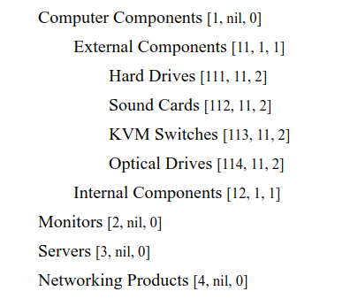


##### <a id="2.2.1.3"></a>Изменение шаблона в зависимости от данных узла [↑](#Оглавление "К оглавлению")

Для изменения шаблонов вывода в зависимости от данных узла мы можем проверять
поля узла `node.li` и `node.ul`. Если поля не пустые, то вместо вывода их
содержимого подставлять собственный динамичный html.

Вывод имеющихся шаблонов узла (`node.li`, `node.ul` и `node._`):

```erb
<ul>
  <% @catalogs.to_a.to_nested.each_nested do |node, origin| %>
    <%= node.li -%>
    <%= origin.name -%> <small>[<%= origin.id %>, <%= origin.parent_id || :nil %>, <%= node.level %>]</small>
    <%= node.ul -%>
    <%= node._ -%>
  <% end %>
</ul>
```

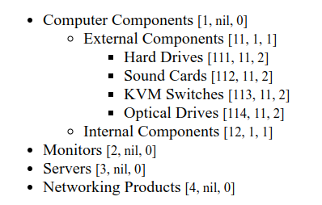

Замена шаблонов на динамический html:

```erb
<% content_for :head do %>
  <style>
    li.level-0 {color: red;}
    li.level-1 {color: green;}
    li.level-2 {color: blue;}
    li.has_children {font-weight: bold;}
    ul.big {border: solid 1px gray;}
  </style>
<% end %>

<ul>
  <% @catalogs.to_a.to_nested.each_nested do |node, origin| %>
    <li class="level-<%= node.level %> <%= 'has_children' if node.is_has_children %>">
    <%= origin.name %> <small>[<%= origin.id %>, <%= origin.parent_id || :nil %>, <%= node.level %>]</small>
    <% if node.ul.present? %>
      <ul class="<%= 'big' if node.children.length > 2 %>">
    <% end %>
    <%= node._ -%>
  <% end %>
</ul>
```

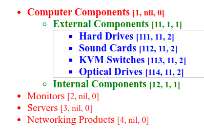

Стоит отметить, что поле `node.li` всегда присутствует в узле, в отличие от
`node.ul`.


##### <a id="2.2.1.4"></a>Расскрывающийся список на основе тега `<details></details>` [↑](#Оглавление "К оглавлению")

```erb
<ul class="nested_array-details">
  <% @catalogs.to_a.to_nested.each_nested details: true do |node, origin| %>
    <%= node.before %>
    <%= origin.name %> <small>[<%= origin.id %>, <%= origin.parent_id || :nil %>, <%= node.level %>]</small>
    <%= node.after %>
  <% end %>
</ul>
```

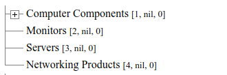

По умолчанию подуровни скрыты, можно управлять отображением подуровней передавая
опцию в метод узла: `node.after(open: …)`:

```erb
<ul class="nested_array-details">
  <% @catalogs.to_a.to_nested.each_nested details: true do |node, origin| %>
    <%= node.before %>
    <%= origin.name %> <small>[<%= origin.id %>, <%= origin.parent_id || :nil %>, <%= node.level %>]</small>
    <%= node.after(open: node.is_has_children) %>
  <% end %>
</ul>
```

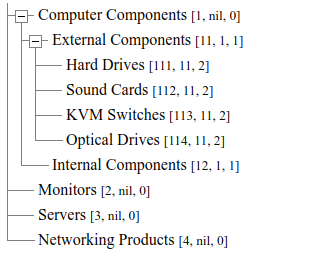


##### <a id="2.2.1.5"></a>Формирование и вывод собственных шаблонов опираясь на изменение уровня узла `node.level` [↑](#Оглавление "К оглавлению")

```erb
<% content_for :head do %>
  <style>
    div.children {margin-left: 1em;}
    div.node {position: relative;}
    div.node::before {
      position: absolute;
      content: "";
      width: 0px;
      height: 0px;
      border-top: 5px solid transparent;
      border-bottom: 5px solid transparent;
      border-left: 8.66px solid red;
      left: -9px;
      top: 3px;
    }
  </style>
<% end %>

<div class="children">
  <% prev_level = nil %>
  <% @catalogs.to_a.to_nested.each_nested do |node, origin| %>

    <%# Уровень повысился? — открываем подуровень. %>
    <% if prev_level.present? && prev_level < node.level %>
      <div class="children">
    <% end %>

    <%# Уровень тот же? — предыдущий закрываем просто. %>
    <% if prev_level.present? && prev_level == node.level %>
      </div>
    <% end %>

    <%# Уровень понизился? - предыдущий закрываем сложно. %>
    <% if prev_level.present? && prev_level > node.level %>
      <% (prev_level - node.level).times do |t| %>
        </div>
        </div>
      <% end %>
      </div>
    <% end %>

    <%# Наш узел. %>
    <div class="node">
    <%= origin.name %>

    <% prev_level = node.level %>
  <% end %>

  <%# Учёт предыдущего уровня при выходе из цикла (Уровень понизился). %>
  <% if !prev_level.nil? %>
    <% prev_level.times do |t| %>
      </div>
      </div>
    <% end %>
    </div>
  <% end %>
</div>
```

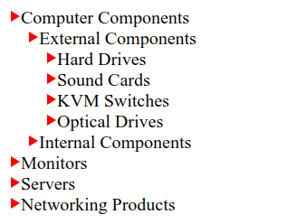


#### <a id="2.2.2"></a>В виде псевдографики [↑](#Оглавление "К оглавлению")

##### <a id="2.2.2.1"></a>Добавление псевдографики перед именем модели методом `nested_to_options` [↑](#Оглавление "К оглавлению")

```erb
<% options = @catalogs.to_a.to_nested.nested_to_options(:name, :id) %>
<pre><code><%= options.pluck(0).join($/) %>
</code></pre>
```

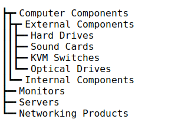


##### <a id="2.2.2.2"></a>Тонкая псевдографика [↑](#Оглавление "К оглавлению")

```erb
<% options = @catalogs.to_a.to_nested.nested_to_options(:name, :id, thin_pseudographic: true) %>
<pre><code><%= options.pluck(0).join($/) %>
</code></pre>
```

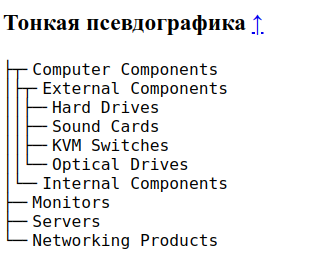


##### <a id="2.2.2.3"></a>Собственная певдографика [↑](#Оглавление "К оглавлению")

```erb
<% options = @catalogs.to_a.to_nested.nested_to_options(:name, :id, pseudographics: %w(┬ ─ ❇ ├ └ &nbsp; │)) %>
<pre><code><%= options.pluck(0).join($/).html_safe %>
</code></pre>
```

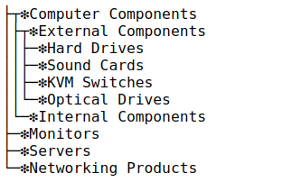


##### <a id="2.2.2.4"></a>Увеличение отступа в собственной псевдографике [↑](#Оглавление "К оглавлению")

```erb
<% options = @catalogs.to_a.to_nested.nested_to_options(:name, :id, pseudographics: ['─┬', '──', '─&nbsp;', '&nbsp;├', '&nbsp;└', '&nbsp;&nbsp;', '&nbsp;│']) %>
<pre><code><%= options.pluck(0).join($/).html_safe %>
</code></pre>
```

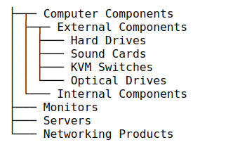


#### <a id="2.2.3"></a>В формах [↑](#Оглавление "К оглавлению")

#### <a id="2.2.3.1"></a>С хелпером `form.select` [↑](#Оглавление "К оглавлению")

```erb
<%= form_with(model: Catalog.find(11), url: root_path, method: :get) do |form| %>
  <%= form.select :parent_id,
    @catalogs.to_a.to_nested.nested_to_options(:name, :id),
    {
      include_blank: 'None'
    },
    {
      multiple: false,
      size: 11,
      class: 'form-select form-select-sm nested_array-select'
    }
  %>
<% end %>
```

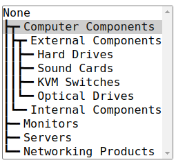


#### <a id="2.2.3.2"></a>С хелперами `form.select` и `options_for_select` [↑](#Оглавление "К оглавлению")

```erb
<%= form_with(model: Catalog.find(11), url: root_path, method: :get) do |form| %>
  <%= form.select :parent_id,
    options_for_select(
      @catalogs.to_a.to_nested.nested_to_options(:name, :id).unshift(['None', '']),
      selected: form.object.parent_id.to_s
    ),
    {
    },
    {
      multiple: false,
      size: 11,
      class: 'nested_array-select'
    }
  %>
<% end %>
```

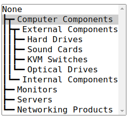


#### <a id="2.2.3.3"></a>Раскрывающийся список с переключателями `form.radio_button` [↑](#Оглавление "К оглавлению")

```erb
<%= form_with(model: nil, url: root_path, method: :get) do |form| %>
  <ul class="nested_array-details">
    <% @catalogs.to_a.to_nested.each_nested details: true do |node, origin| %>
      <%= node.before %>
      <%= form.radio_button :parent_id, origin.id %>
      <%= form.label :parent_id, origin.name, value: origin.id %>
      <small>[<%= origin.id %>, <%= origin.parent_id || :nil %>, <%= node.level %>]</small>
      <%= node.after(open: node.is_has_children) %>
    <% end %>
  </ul>
<% end %>
```

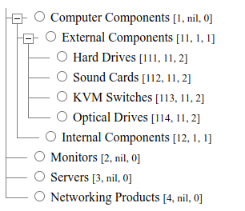


## Разработка

Часто используемые команды

```sh
# rspec управляет загружаемыми гемами, поэтому сам rspec запускается НЕ `bundle
# exec rspec`, а просто `rspec` или `./bin/rspec`.
rspec ./spec/lib/nested_array_spec.rb
rspec ./spec/lib/nested_array/nested_spec.rb
bundle exec yard doc # Докумментировать в doc/_index.html
gem build
gem push ./nested_array-…
```

Для подключения локальной версии гема в rails замените в строке подключения
(файл Gemfile) второй аргумент (версию) на опцию path:

```rb
# Gemfile
# Работа с древовидными массивами
gem "nested_array", path: "../nested_array"
```
