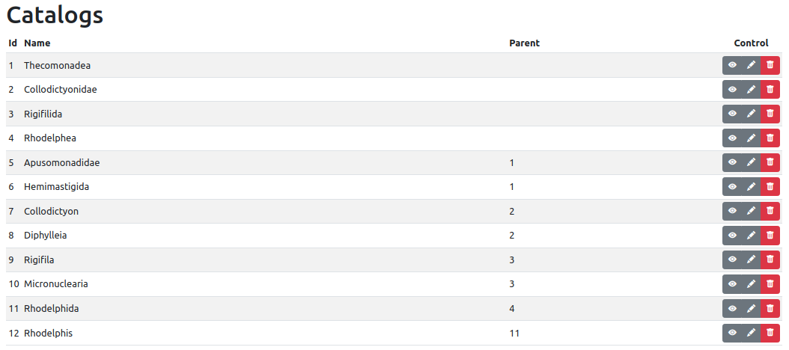
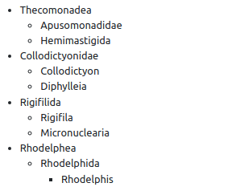
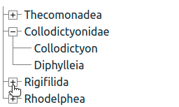
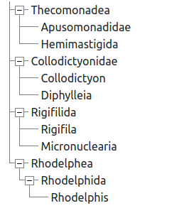

# NestedArray

Предназначен для преобразования в древовидную структуру плоских данных описанных
по паттерну «Список смежности» (Adjacency List), то есть в нодах указа предок
`parent_id`. Например:

```ruby
[
  {id: 1, parent_id: nil, name: 'first', …},
  {id: 2, parent_id:   1, name: 'second', …},
  {id: 3, parent_id:   1, name: 'third', …}
]
# ↓ ↓ ↓
[
  {id: 1, parent_id: nil, name: 'first', children: [
    {id: 2, parent_id:   1, name: 'second', …},
    {id: 3, parent_id:   1, name: 'third', …}
  ], …}
]
```


## Установка

Добавте строку в _Gemfile_ вашего приложения:

```ruby
# Работа с древовидными массивами.
gem "nested_array", "~> 3.0"
```

И затем выполните `bundle install`.

Или установите его как `gem install nested_array`

Если вы планируете использовать скромный CSS гема, добавте в
файл _app/assets/stylesheets/application.scss_:

```css
/* Отображение древовидных массивов. */
@import "nested_array";
```


## Использование

<a name="methods"></a>
* Список методов
  * [to_nested](#to_nested) — преобразует плоскую структуру во вложенную;
  * [each_nested](#each_nested) — перебирает вложенную стуктуру;
  * [each_nested!](#each_nested) — перебирает вложенную стуктуру, предоставляя доступ к исходным данным;
  * [nested_to_html](#nested_to_html) — преобразует вложенную структуру в html вёрстку (многоуровневый список `<ul><li>…`);
  * [nested_to_options](#nested_to_options) — преобразует вложенную структуру в массив для формирования опций html-тега `<select>` с псевдографикой;
  * [nested_to_collection_select](#nested_to_collection_select) — преобразует вложенную структуру в плоскую но добавляет псевдографику в тектовое поле для формирования тэга `<select>`;
  * [concat_nested](#concat_nested) — скеивание вложенных структур, ноды склеиваются если путь к ним одинаков.
* Вывод
  * Вложенный список ul > li


### Список методов

<a name="to_nested"></a>
#### to_nested [↑](#methods "К методам")

Преобразует плоскую структуру во вложенную.

```ruby
a = [{'id' => 1, 'parent_id' => nil}]
a = NestedArray::Array.new a
b = a.to_nested
```

__Опции__

У каждой ноды вложенной структуры есть базовые свойства, такие как
идентификатор, идентификатор предка и другие. Для доступа к этим данным
используются ключи, которые можно настроить как в примере ниже. По умолчанию
используются следующие __строковые__ (_чувствительны к string/symbol_) ключи:

```ruby
b = a.to_nested({
  id: 'id',               # указывает какое свойство ноды является идентификатором;
  parent_id: 'parent_id', # -//- предком;
  children: 'children',   # -//- массивом потомков;
  level: 'level'          # -//- дополнительным свойством с уровнем вложенности;
  root_id: nil            # определяет что является корнем для построения дерева,
                          # например, для построения ветви корнем корнем
                          # является идентификатор одной из нод.
})
```

Дополнительные опции преобразования:

```ruby
b = a.to_nested({
  hashed: false,    # потомки могут храниться не в массиве а в хэше;
  add_level: false, # добавляет в ноду информацию о уровене вложенности ноды;
})
```


<a name="each_nested"></a>
#### each_nested [↑](#methods "К методам")

Перебирает вложенную стуктуру.

```ruby
nested.each_nested do |node, parents, level, is_last_children|
  puts node             # > {'id' => ...}
  puts parents          # > [{'id' => ...}]
  puts level            # > 0
  puts is_last_children # > false
end
```


<a name="nested_to_html"></a>
#### nested_to_html [↑](#methods "К методам")

Формирует _html_-код для вывода вложенных структур с использованием вложенных друг в друга списков `<ul>`.

__Пример__

```ruby
[
  {'id' => 1, 'parent_id' => nil, 'name' => 'first'},
  {'id' => 2, 'parent_id' =>   1, 'name' => 'second'},
  {'id' => 3, 'parent_id' =>   1, 'name' => 'third'}
].to_nested.nested_to_html do |node|
  node['name']
end
```

Вернёт

```html
	<li>first
		<ul>
			<li>second</li>
			<li>third</li>
		</ul>
	</li>
```

__Расширенный пример__

```ruby
.nested_to_html li: '<li class="my">', _ul: '<i></i></ul>' do |node, parents, level|
  block_options = {}
  block_options[:li] = '<li class="my current">' if node['id'] == 2
  [
  	"id: #{node['id']}, #{node['name']}, parent name: #{parents[level]&.[]('name')}",
  	block_options
  ]
end
```

__Опции__

Все опции могут быть аргументами метода, и только некоторые опции влияют на результат через блок — на лету (последняя строка блока).

```ruby
tabulated: true,
inline: false,
tab: "\t",
ul:  '<ul>', # может задаваться блоком
_ul: '</ul>',
li:  '<li>', # может задаваться блоком
_li: '</li>',
```


<a name="nested_to_options"></a>
#### nested_to_options [↑](#methods "К методам")

Формирования опций для html-тега &lt;select&gt;

Возвращает массив с псевдографикой, позволяющей вывести древовидную структуру.

```ruby

[['option_text1', 'option_value1'],['option_text2', 'option_value2'],…]
```

__Опции__

```ruby
option_value: 'id', # Что брать в качестве значений при формировании опций селекта.
option_text: 'name',
```


<a name="nested_to_collection_select"></a>
#### nested_to_collection_select [↑](#methods "К методам")

Преобразует вложенную структуру данных в плоскую, но добавляет в значение поля
отвечающего за текстовое представление (:name) псевдографику древовидной
структуры.

Это позволяет вывести тэг select в сносном виде для использования с вложенными
структурами.

Пример с хелпером `collection_select`

```rb
<%= form.collection_select :catalog_ids,
  Catalog.all.to_a.to_nested.nested_to_collection_select, :id, :name,
  {
    # prompt: true
    # include_blank: true
  },
  {
    multiple: true,
    size: 10
  }
%>
```

Пример с хелпером `select` в сочетании с `options_from_collection_for_select`

```erb
<% catalogs = Catalog.all.to_a %>
<%= form.select :catalog_ids,
  options_from_collection_for_select(
    catalogs.to_nested.nested_to_collection_select, :id, :name,
    disabled: catalogs.select{|x| x.hidden?}.pluck(:id),
    selected: form.object.catalog_ids
  ),
  {
    # prompt: true
    # include_blank: true
  },
  {
    multiple: true,
    size: 10
  }
%>
```


<a name="concat_nested"></a>
#### concat_nested [↑](#methods "К методам")

Скеивание вложенных структур.

* Ноды склеиваются если путь к ним одинаков;
* Путь определяется из сложения Текстов (конфигурируемо через :path_key);

__Опции__

```ruby
path_separator: '-=path_separator=-',
path_key: 'text',
```


### Вывод

#### Вложенный список ul-li



```ruby
<ul>
  <% @catalogs.to_a.to_nested.each_nested do |node, origin| %>
    <%= node.before -%>
    <%= node.name -%>
    <%= node.after -%>
  <% end %>
</ul>
```



#### Вложенный расскрывающийся список

```ruby
<ul class="nested_array-details">
  <% @catalogs.to_a.to_nested.each_nested details: true do |node, origin| %>
    <%= node.before -%>
    <%= node.name -%>
    <%= node.after -%>
  <% end %>
</ul>
```



Если необходимо открыть некоторые узлы

```ruby
<ul class="nested_array-details">
  <% @catalogs.to_a.to_nested.each_nested details: true do |node, origin| %>
    <%= node.before -%>
    <%= node.name -%>
    <%= node.after(open: node.is_has_children) -%>
  <% end %>
</ul>
```




## Разработка

…


## Содействие

…


## Лицензия

В соответствии с условиями [лицензии MIT](https://opensource.org/licenses/MIT).
